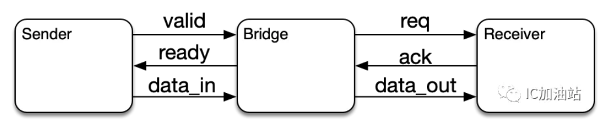
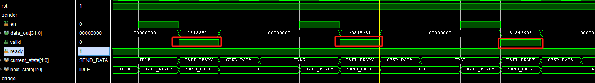
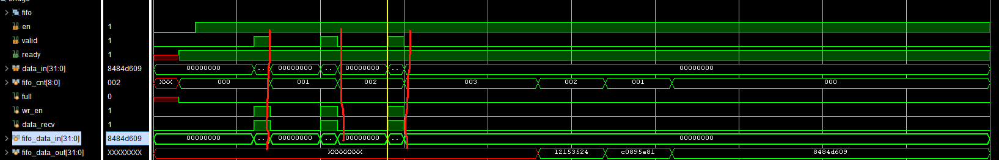
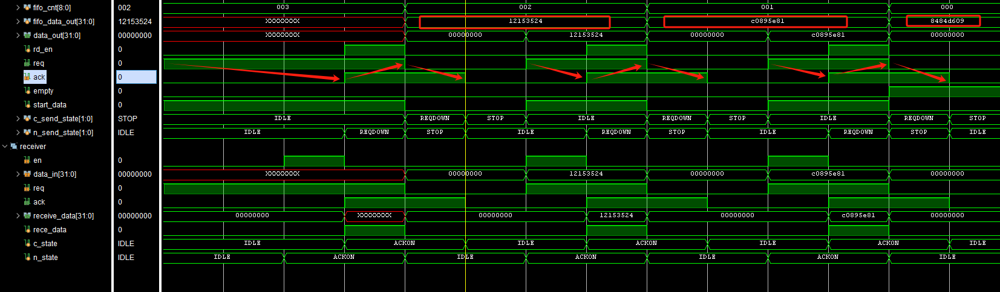
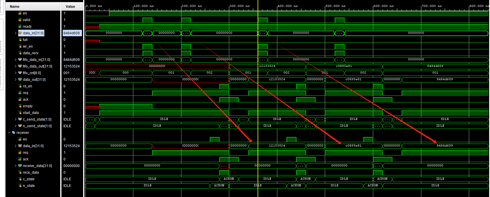
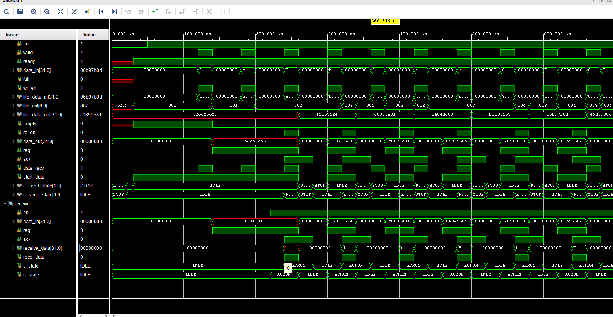

# 握手协议

### 学习博客

[一道Nvidia的面试题](https://mp.weixin.qq.com/s/EDAjjVJzzyKstI10fqv6Lw)[跨时钟域处理------握手协议verilog（究极保姆级教程)_跨时钟域握手-CSDN博客](https://blog.csdn.net/qq_45842366/article/details/132887208)

[Verilog设计Valid-Ready握手协议_valid ready握手verilog-CSDN博客](https://blog.csdn.net/maowang1234588/article/details/100065072)

### 题目要求

设计一个valid/ready到4-phase handshake的一个转换器

### 设计记录

valid ready协议：在valid和ready都为高的时候，数据在时钟上升沿完成传输

#### valid_ready

valid_ready信号中ready信号由FIFO的满信号（full控制），不满则一直拉高

valid信号拉高期间，sender发送一个随机数，作为伪发送信息；

在valid和ready都高（本次设计中为valid上升沿时，数据载入fifo，FIFO数据计数+1）

#### 4phase

首先空闲状态拉高req（若fifo没空），等待ack拉高，随后在ack拉高时传递数据，fifo_cnt-1，ack看到req拉低于是也拉底，完成4phase协议。

bridge与sender和receiver同时进行协议

valid_ready信号写入的东西：

32'h12153524  32'hc0895e81  32'h8484d609

4phase读出：

32'h12153524  32'hc0895e81  32'h8484d609

以上为持续读写展示

##### tips:

sv写状态机枚举时定义清楚位宽与类型，位宽不定义可能导致状态只能读取前两个然后出现死循环
