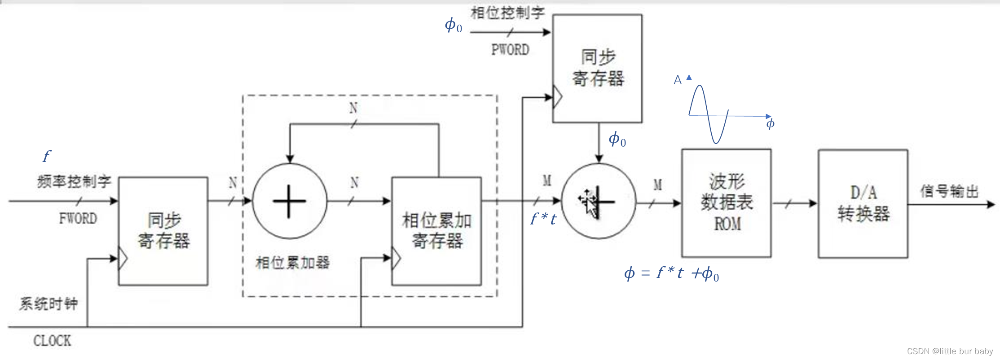
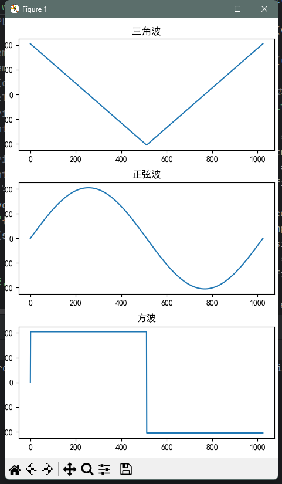
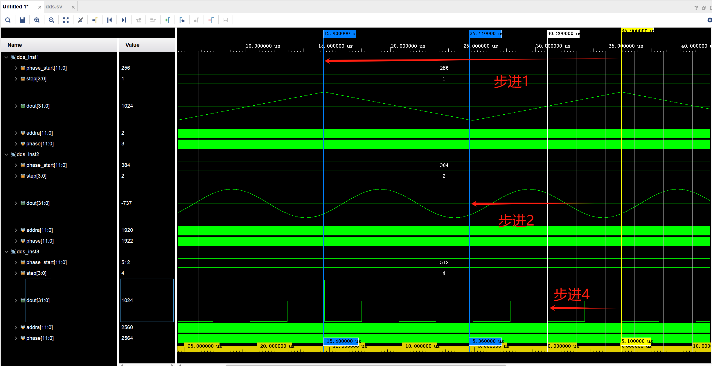
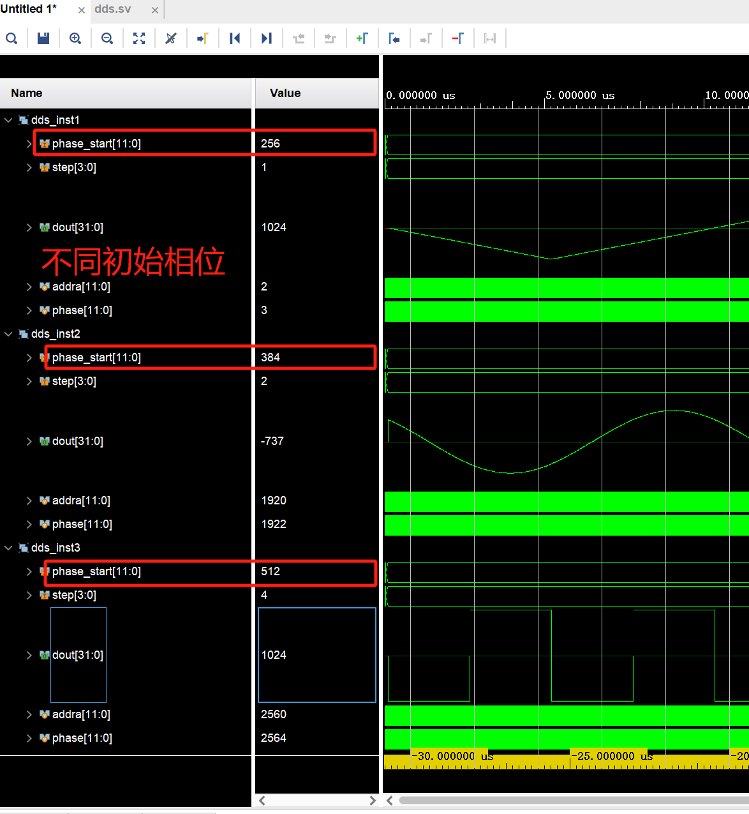

# DDS（Direct Digital Synthesizer）学习记录

## 优质学习博客

[彻底理解DDS（信号发生器）的fpga实现（verilog设计代码）_dds信号发生器-CSDN博客](https://blog.csdn.net/qq_44366923/article/details/125779015)

[Verilog 代码编写 DDS信号发生器（幅频相可调正弦波、方波、三角波、锯齿波）纯VIVADO编写仿真_verilog dds-CSDN博客](https://blog.csdn.net/qq_46132759/article/details/122651657)

## 编写思路

初始化RAM数据，存放正弦波、方波、三角波，读取RAM进行输出

制作一个初始相位和相位步进可以修改的信号发生器

### 存进初始化DDS的RAM的数据

### Vivado仿真结果

