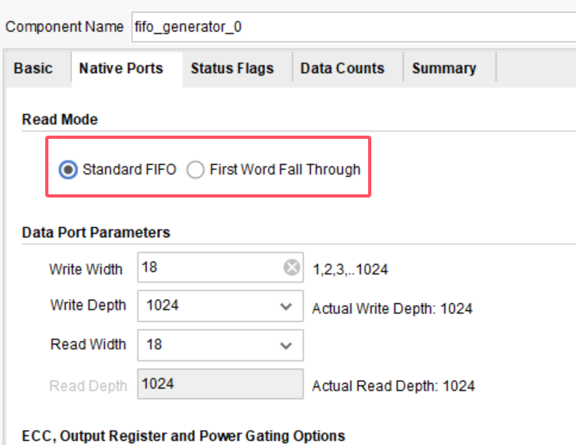
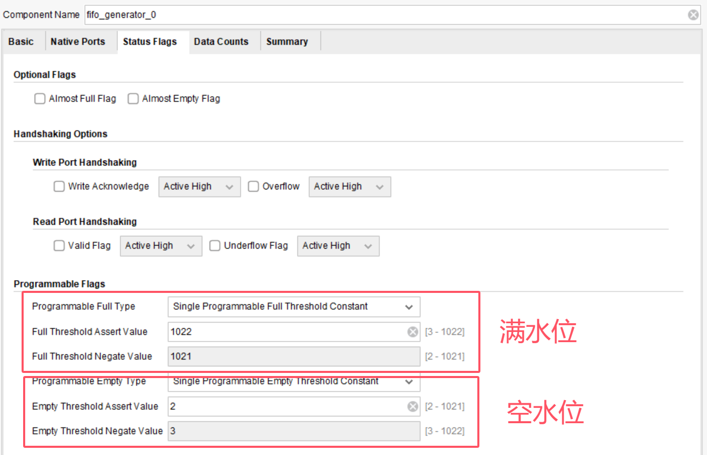
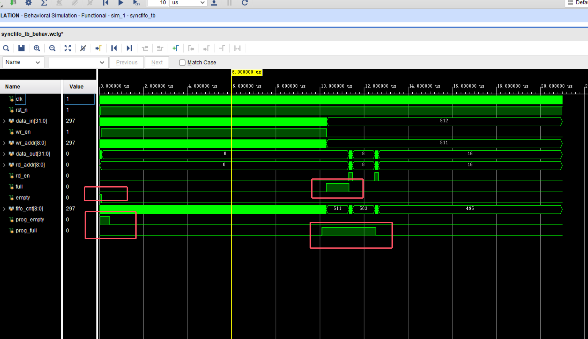
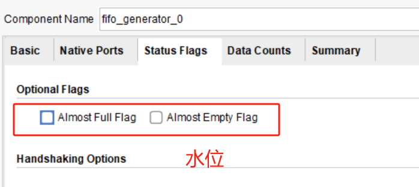
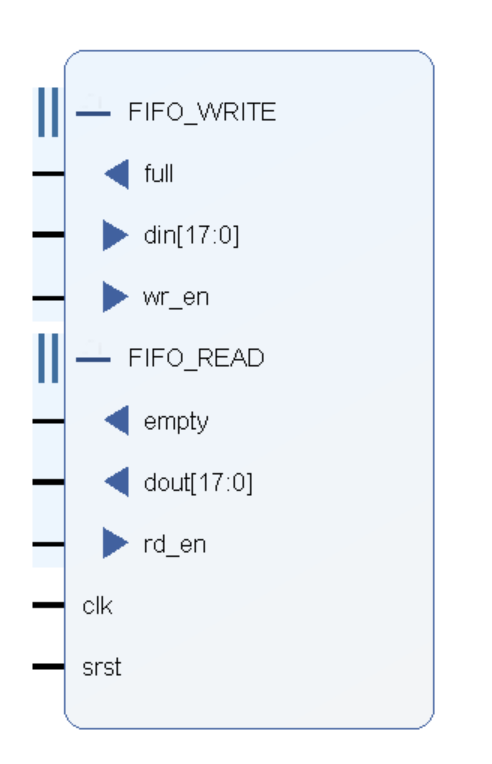
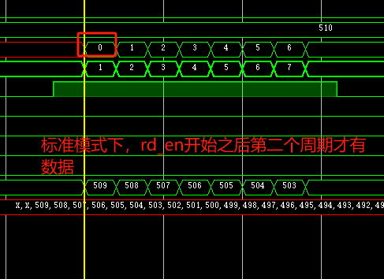

# Sync FIFO

FIFO与普通的RAM的区别：没有地址线，只能顺序写顺序读数据

### 设计目标

完成一个深度512，位宽32的同步fifo设计，要求实现first word fall through。

### 附加

实现可编程的水位线，读写fifo握手信号

### 学习记录

[vivado中FIFO IP核的Standard FIFO和First-word-Fall-Through模式的仿真比较_first word fall through-CSDN博客](https://blog.csdn.net/woshiyuzhoushizhe/article/details/106173261)

[同步FIFO的两种Verilog设计方法（计数器法、高位扩展法）_同步fifo verilog-CSDN博客](https://blog.csdn.net/wuzhikaidetb/article/details/121136040)

## Fifo的两种模式：

#### Standard模式：

在读使能信号有效的下一个周期才能读出第一个有效的数据；

#### FWFT模式：

在读使能信号有效的第一个周期就能能读出第一个有效的数据； 这是因为在这种模式下，FIFO提前把数据已经准备到了数据输出总线上（对外透明），等待都使能有效就输出到数据输出端口（组合逻辑），但在这种模式下，valid信号将会在复位后就保持有效，这一点要特别注意；

## 水位相关

**prog_full** ：写FIFO将要满的时候，这个数值与你设置的数据相关，达到你设置的数据和以上时，此信号就会被拉高；
**prog_empty** ：读FIFO将要空的时候，这个数值与你设置的数据相关，达到你设置的数据和以下时，此信号就会被拉高；

### 相关参数

full threshold assert value：数据累计上升时，经过此阈值，持续拉高
full threshold negate value：数据累计下降时，经过此阈值，拉低
empty threshold assert value：数据累计下降时，经过此阈值，持续拉高
empty threshold negate value：数据累计下降时，经过此阈值，拉低

### 对IP核测试结果

测试的tb在tb文件夹中

### 自己编写的sv的测试结果

## 设计要点

读指针：总是指向当前要读出的数据，地址不对外，顺序执行不对外接

写指针：总是指向要写数据的下一个单元，地址不对外，顺序执行不对外接

空标志位：fifo数据读完

满标志位：FIFO写满

水位线：快满或者快空的时候出现的报警标志

## 简易FIFO设计（参考IP核中FIFO端口设置）

### 仿真结果

#### FWFT模式数据透明

读取数据“无延迟”

#### 标准模式数据得使能信号来才能看

读取数据有一个延迟
