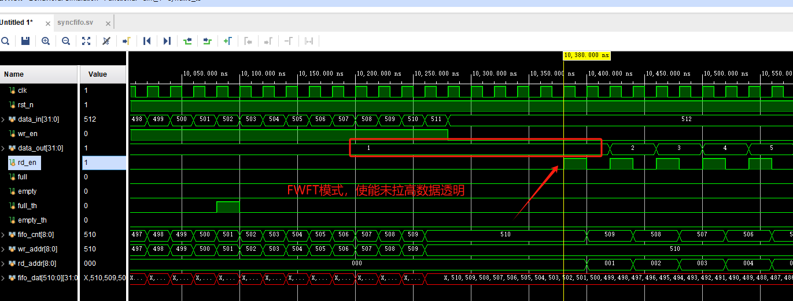
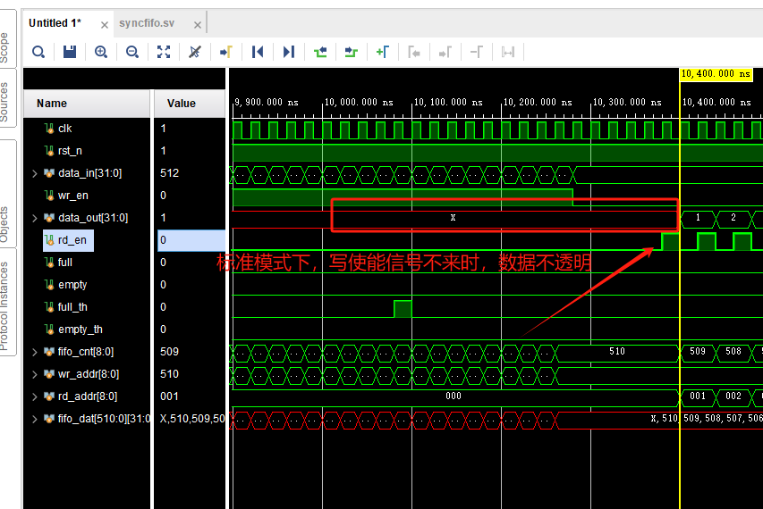
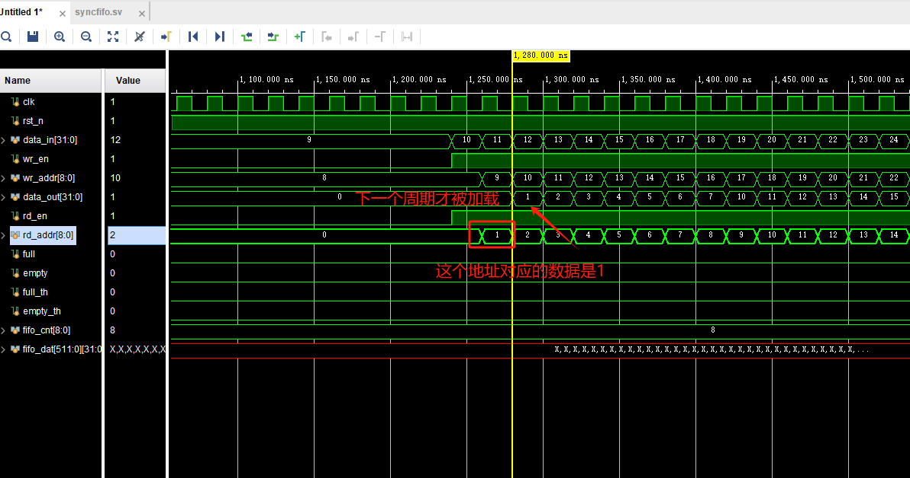
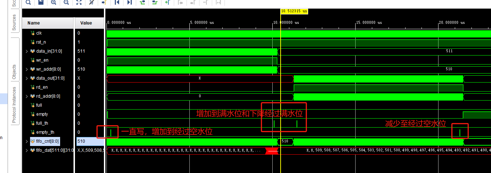

# Sync FIFO

FIFO与普通的RAM的区别：没有地址线，只能顺序写顺序读数据

### 设计目标

完成一个深度512，位宽32的同步fifo设计，要求实现first word fall through。

### 附加

实现可编程的水位线，读写fifo握手信号

### 学习记录

[vivado中FIFO IP核的Standard FIFO和First-word-Fall-Through模式的仿真比较_first word fall through-CSDN博客](https://blog.csdn.net/woshiyuzhoushizhe/article/details/106173261)

[同步FIFO的两种Verilog设计方法（计数器法、高位扩展法）_同步fifo verilog-CSDN博客](https://blog.csdn.net/wuzhikaidetb/article/details/121136040)

## Fifo的两种模式：

#### Standard模式：

在读使能信号有效的下一个周期才能读出第一个有效的数据；

#### FWFT模式：

在读使能信号有效的第一个周期就能能读出第一个有效的数据； 这是因为在这种模式下，FIFO提前把数据已经准备到了数据输出总线上（对外透明），等待都使能有效就输出到数据输出端口（组合逻辑），但在这种模式下，valid信号将会在复位后就保持有效，这一点要特别注意；

## 设计要点

读指针：总是指向当前要读出的数据，地址不对外，顺序执行不对外接

写指针：总是指向要写数据的下一个单元，地址不对外，顺序执行不对外接

空标志位：fifo数据读完

满标志位：FIFO写满

水位线：快满或者快空的时候出现的报警标志

## 简易FIFO设计（参考IP核中FIFO端口设置）

### 仿真结果

#### FWFT模式数据透明

#### 标准模式数据得使能信号来才能看

#### 水位设置与显示

