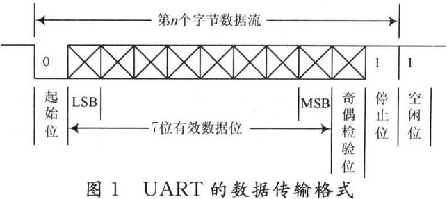
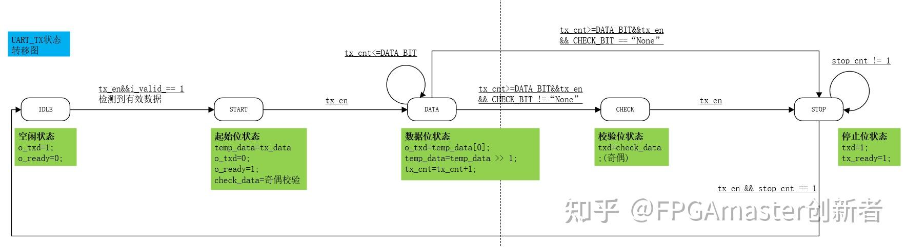
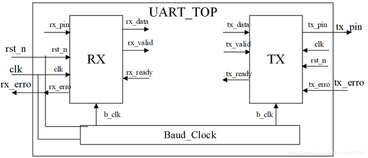
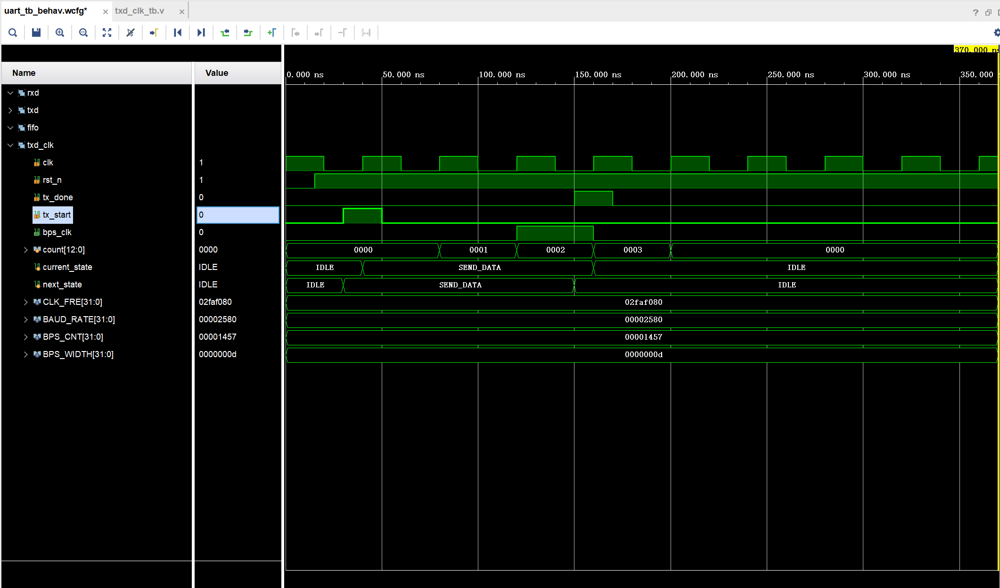
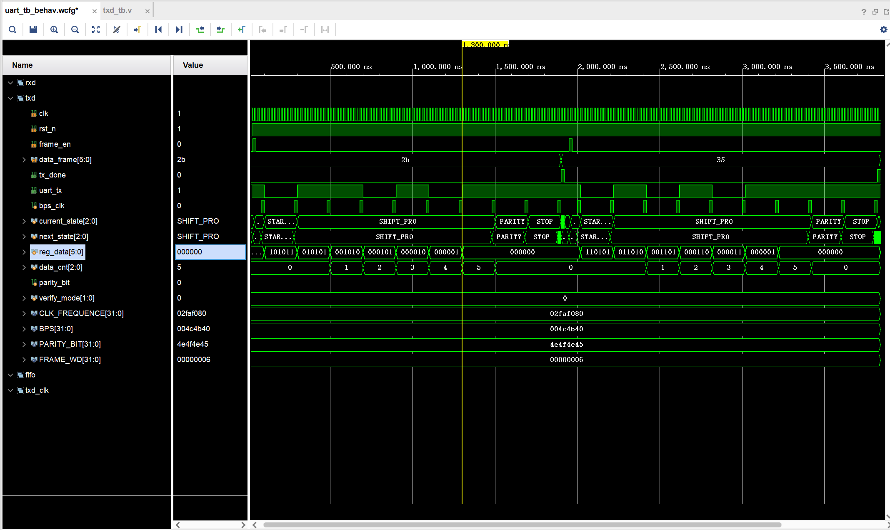
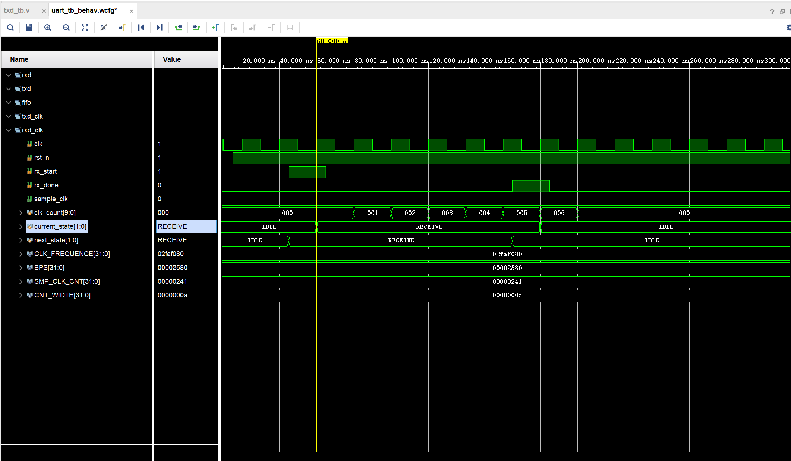
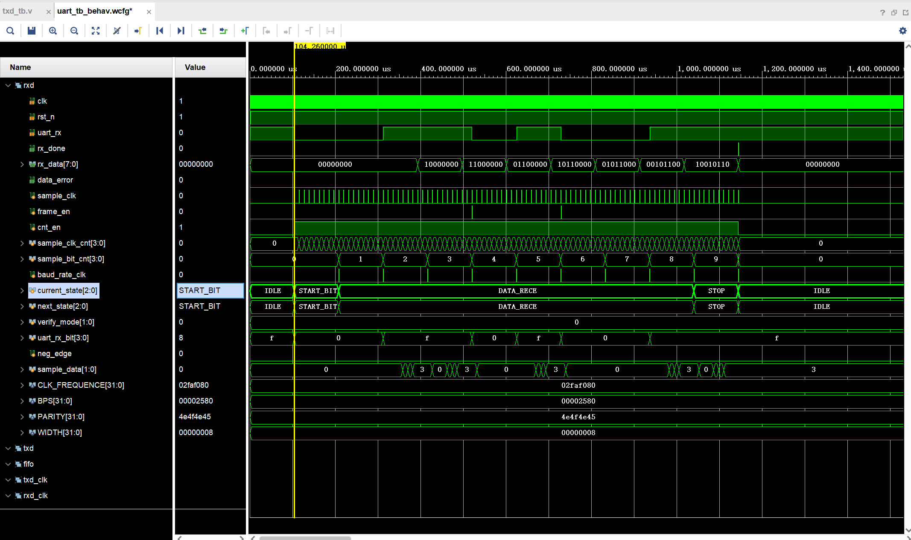
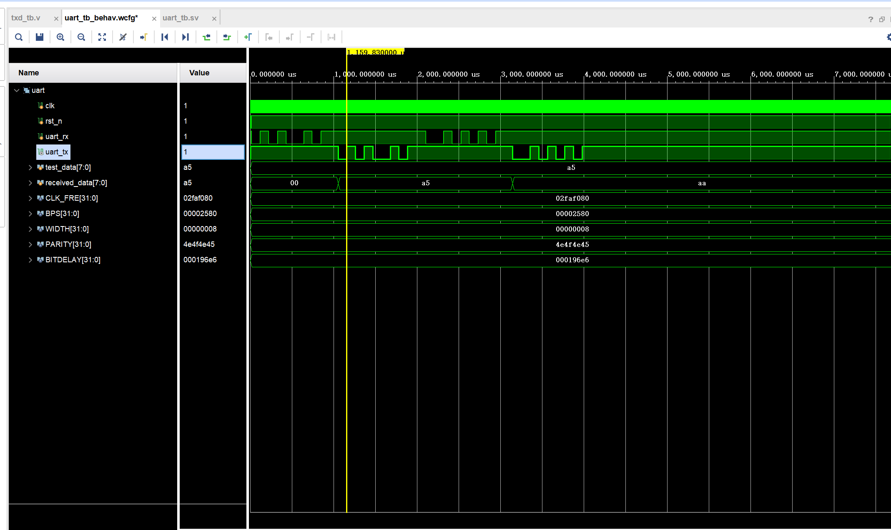
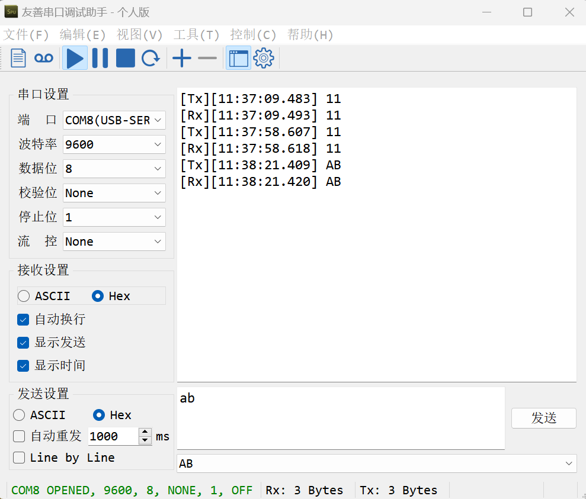

# uart学习记录：

## 优质博客

[【FPGA协议篇】UART通信及其verilog实现(代码采用传参实现模块通用性，适用于快速开发)_fpga串口波特率自适应设计-CSDN博客](https://blog.csdn.net/qq_38812860/article/details/119940848)

[FPGA协议篇：最简单且通用verilog实现UART协议 - 知乎 (zhihu.com)](https://zhuanlan.zhihu.com/p/687628445)

**1空闲位：**UART协议规定，当总线处于空闲状态时信号线的状态为‘1’即高电平，表示当前线路上没有数据传输。

**2起始位：**每开始一次通信时发送方先发出一个逻辑”0”的信号（低电平），表示传输字符的开始。因为总线空闲时为高电平所以开始一次通信时先发送一个明显		  区别于空闲状态的信号即低电平。

**3数据位**：起始位之后就是我们所要传输的数据，数据位可以是5、6、7、8，9位等，构成一个字符（一般都是8位）。如ASCII码（7位），扩展BCD码（8位）。先发送最低位，最后发送最高位，使用低电平表示‘0’高电平表示‘1’完成数据位的传输。

**4奇偶校验位：**数据位加上这一位后，使得“1”的位数应为偶数(偶校验)或奇数(奇校验)，以此来校验数据传送的正确性。校验位其实是调整个数，串口校验分几种方式：

1. 无校验（no parity）；
2. 奇校验（odd parity）：如果数据位中“1”的数目是偶数，则校验位为“1”，如果“1”的数目是奇数，校验位为“0”；
3. 偶校验（even parity）：如果数据为中“1”的数目是偶数，则校验位为“0”，如果为奇数，校验位为“1”；
4. mark parity：校验位始终为1（不常用）；
5. parity：校验位始终为0（不常用）。

**5停止位：**它是一个字符数据的结束标志。可以是1位、1.5位、2位的高电平。 由于数据是在传输线上定时的，并且每一个设备有其自己的时钟，很可能在通信中两台设备之间出现了小小的不同步。因此停止位不仅仅是表示传输的结束，并且提供计算机校正时钟的机会。停止位个数越多，数据传输越稳定，但是数据传输速度也越慢。

## 波特率与时钟频率：

1. **时钟频率：**每秒钟的时钟周期数；
2. **波特率：**每秒钟传输的符号数，一个符号可以代表一个或多个bit（视调制方式而定）对于串口通信，波特率=bit/s；
3. **比特bit：**计算机数据的最小单位，表示一个二进制位，可以是0或1；
4. **字节byte:**1 Byte = 8 Bits

## uart_tx状态机：

1. **IDLE：**空闲状态，无数据传输，输出高电平，当i_valid信号到来时跳转到START状态；
2. **START**：起始位，无数据传输，输出低电平为 ，无条件跳转至DATA状态；
3. **DATA：**数据位，进行数据传输，先发送低比特，根据数据输出高低电平，假如有校验位，跳到CHECK状态，假如数据传输不设校验位，跳转到STOP状态；
4. **CHECK：**奇偶校验位处理状态，根据CHECK_BIT参数进行添加校验位值。
5. **STOP：**停止位状态，输出STOP_BIT个高电平。

## Testbench验证

### 1.tx_clk的前仿

编写测试向量完成对tx时钟产生的仿真，能看到tx_start信号给出后状态机跳转，tx_done信号给出后，状态机跳回空闲状态

### 2.tx的仿真

编写测试向量模拟要发送信息的状态，能看到触发信号frame_en的控制下，状态机正常调整，uart_tx信号线的反转与待发送信号的特征吻合

### 3.rxd_clk的前仿

编写测试向量完成对rx时钟产生的仿真，能看到rx_start信号给出后状态机跳转，rx_done信号给出后，状态机跳回空闲状态

### 4.rxd的前仿

编写测试向量模拟接收信号状态，发送起始位之后发送八位信号，同时将波特率对应计算每个bit对应的时间间隔，对uart_rx编写测试向量，发现状态机和对应采样信号，获取的数据均与预期吻合。

### 5.顶层模块的前仿

对顶层模块仿真，本次使用了fifo这个IP核暂时存取接收的信号，用以完成数据loop的操作，从波形不难看出，uart_loop功能正常实现

## 上板验证

经过测试，发送的信息均经过uart_loop，即完成“接收->fifo暂存->读取->发送回PC”，功能正确
